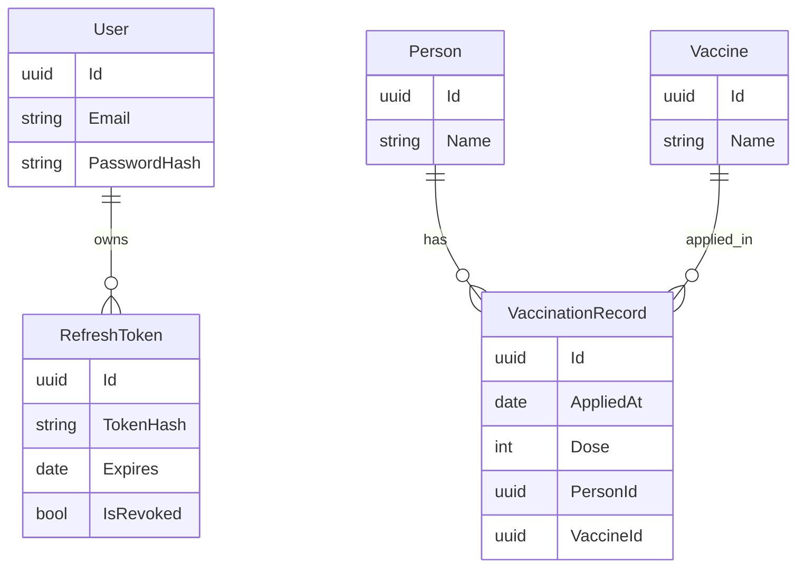

# Vaccination Manager Backend

Backend for the "Vaccination Manager" technical challenge. Lightweight, testable API implemented with .NET 8, EF Core and a clear layered structure (API -> Application -> Domain -> Infrastructure).

**Frontend Repository:** [Vaccination Manager Fronted](https://github.com/Ghitado/vaccination-manager-frontend)


## Table of contents

- [Overview](#overview)
- [Tech stack](#tech-stack)
- [Features](#features)
- [Run locally](#run-locally)
- [Docker Compose](#docker-compose)
- [Project structure](#project-structure)
- [API routes and examples](#api-routes-and-examples)
- [Validation and error handling](#validation-and-error-handling)
- [Persistence and Fluent API](#persistence-and-fluent-api)
- [Authentication and authorization](#authentication-and-authorization)
- [Health check and logging](#health-check-and-logging)
- [Architectural decisions](#architectural-decisions)
- [Possible Improvements (Roadmap)](#possible-improvements-roadmap)
- [Author](#author)

---

## Overview

Manage persons, vaccines and vaccination records. The API follows RESTful conventions, returns JSON, and exposes Swagger UI for interactive documentation.

Instead of just building a simple CRUD, I focused on architectural quality. I used **Clean Architecture** to keep the core logic testable and decoupled. I also implemented a custom **JWT & Refresh Token** authentication flow (using HttpOnly cookies) to handle security properly without relying on heavy default templates.


---

## Tech stack

- .NET 8 (Web API)
- Entity Framework Core (EF Core)
- Custom JWT Authentication (Stateless)
- PostgreSQL (development and production)
- BCrypt.Net (Password Hashing)
- Mapster (DTO mapping)
- Swashbuckle / Swagger (API docs)
- Docker / Docker Compose (containerized development)
- xUnit (unit tests for domain)

---

## Features

- **CRUD** for Person, Vaccine and VaccinationRecord.
- **Pagination** support for list endpoints.
- **DTOs** for API responses (Separation of concerns).
- **Swagger** with XML comments enabled.
- **Custom JWT Authentication:**
  - Stateless architecture (no ASP.NET Identity tables).
  - **Refresh Token** implementation using HttpOnly Cookies (XSS protection).
  - Secure Password Hashing with **BCrypt**.
- **Database Seeding:** Automatic seeding of Admin user and initial vaccines on startup (Development mode).
- **Postgres** database in Docker for consistent local development.

---

## Database Schema

The database model respects the separation between Auth (Access) and Business Domain (Vaccination).



---

## Prerequisites

- .NET 8 SDK
- Git
- Docker and Docker Compose

### Run locally

1. Clone the repository:
```bash
git clone https://github.com/Ghitado/vaccination-manager-backend.git 
cd vaccination-manager-backend 
dotnet restore 
dotnet build
```

2.Create a `.env` file in the root directory (or rename `.env.example`) to configure database credentials and JWT Key:
```bash
DB_USER=postgres
DB_PASSWORD=ExamplePassword123!
DB_NAME=ExampleDb
JWT_KEY=ALongRandomStringWithMoreThan64CharactersHereForSecurityFromJWT512Bits
```

### Running Tests

To execute the unit tests for the Domain layer:

```bash
dotnet test
```

### Docker Compose (Recommended)

Build and run the entire stack (API + Postgres) with a single command:

```bash
docker compose up --build
```

The API will be available at `http://localhost:5001/swagger`.

---

## Project structure

- `src/VaccinationManager.Api/` — Controllers, Program.cs, Swagger, Docker setup.
- `src/VaccinationManager.Application/` — Use Cases, DTOs, Interfaces (Ports).
- `src/VaccinationManager.Domain/` — Entities, Repository Interfaces, Domain Exceptions.
- `src/VaccinationManager.Infrastructure/` — EF Core Implementation, Migrations, Security Implementations (JWT/BCrypt).
- `tests/` — Unit tests.

---

## API routes and examples

Base URL: `https://localhost:5001`. All endpoints use JSON.

Auth
- POST `/api/auth/register` — Register a new user.
- POST `/api/auth/login` — Authenticate user.
- POST `/api/auth/refresh` — Renew Access Token.

Persons
- POST `/api/person` — Create person.
- GET `/api/person?pageNumber=1&pageSize=10` — List persons (paginated).
- GET `/api/person/{id}` — Get person by id (it will also retrive the vaccination records).
- DELETE `/api/person/{id}` — Delete person by id.

Vaccines
- POST `/api/vaccine` — Create vaccine
  - **Validation:** Prevents future dates and ensures IDs exist.
- GET `/api/vaccine?pageNumber=1&pageSize=10` — List vaccines (paginated).

VaccinationRecords
- POST `/api/vaccinationrecord` — Create vaccination record.
- DELETE `/api/vaccinationrecord/{id}` — Delete vaccination record by id.

---

## Validation and error handling

- **DTO Validation:** Uses Data Annotations (`[Required]`, `[EmailAddress]`, `[StringLength]`) for immediate feedback.
- **Domain Validation:** Entities protect their invariants (for example, `Dose > 0`).
- **Global Exception Handler:** Middleware translates exceptions into proper HTTP Status Codes:
  - `DomainException` -> `400 Bad Request`
  - `UnauthorizedAccessException` -> `401 Unauthorized`
  - `KeyNotFoundException` -> `404 Not Found`
	 
---

## Persistence and Fluent API

- **PostgreSQL** is the database provider.
- **Fluent API** (`IEntityTypeConfiguration`) is used to configure schema, indexes, and relationships, keeping the Domain entities clean of persistence attributes.
- **UTC Enforcement:** Dates are converted to UTC before saving to ensure compatibility with Postgres `timestamp with time zone`.

---

## Authentication and authorization

- **Custom Implementation:** Instead of using the heavy ASP.NET Core Identity, a lightweight custom authentication system was built following Clean Architecture principles.
- **JWT (Access Token):** Short-lived token for authorization.
- **Refresh Token:** Long-lived, opaque token stored in the database (hashed) and sent via **HttpOnly Secure Cookie** to prevent XSS attacks.
- **BCrypt:** Used for secure password hashing.

---

## Health check and logging

- **Health Check:** Exposes `GET /health` (public) for uptime monitoring and Docker probes.
- **Logging:** Built-in `ILogger` is used with structured logging in Controllers to track operations (for example, "User registered with ID: {Id}").

---

## Architectural decisions

- **Clean Architecture:** Strict separation of concerns (Domain, Application, Infrastructure, API). Dependencies point inwards.
- **Custom Auth vs Identity:** Chose to implement a custom JWT flow to reduce complexity/overhead and have full control over the Refresh Token mechanism.
- **Docker Compose:** Ensures the development environment (API + DB) is identical across machines.
- **Repository Pattern:** Abstraction over EF Core to allow easier testing and decoupling.
- **Health Check Strategy:** A specific, public `/health` endpoint was implemented to allow the frontend to "ping" the server and detect when the free-tier hosting is waking up, improving user experience during cold starts.
 
---

### Possible Improvements 

- **Dose Modeling:** Currently, the system uses an integer to represent doses (1, 2, 3...). In a real-world public health scenario, I would refactor the `VaccinationRecord` entity to include an `Enum` for **Dose Type** (Primary, Booster, Single) and **Strategy** (Routine, Campaign), enabling precise epidemiological reporting.

---

## Author

Developed by **Thiago de Melo Mota** as part of a technical challenge. 